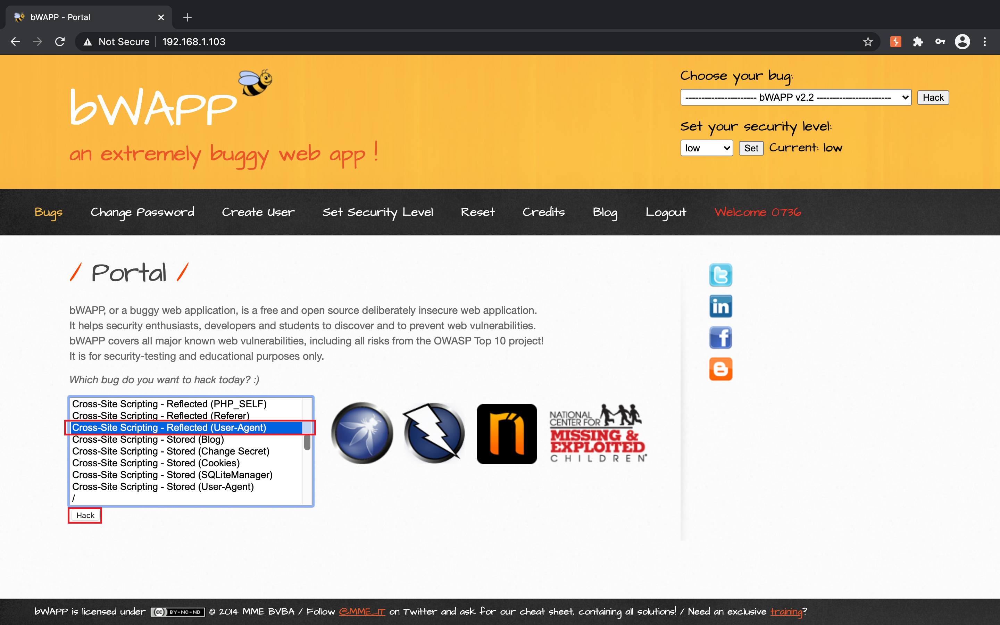
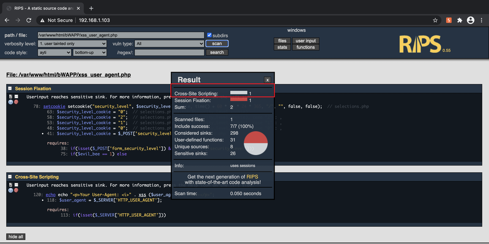
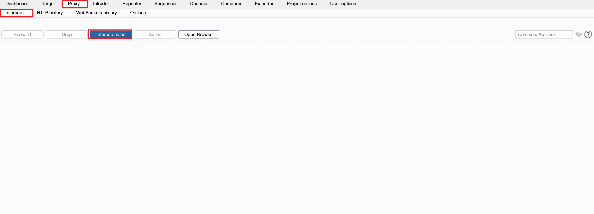
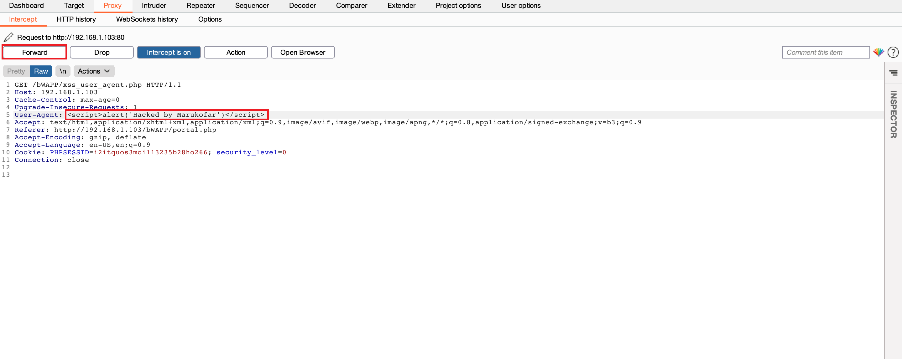
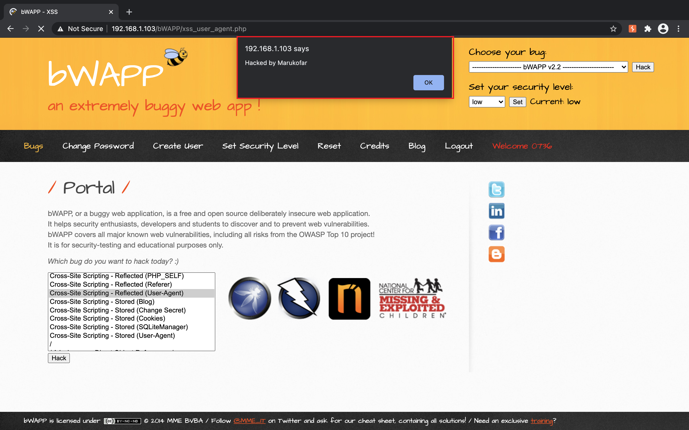
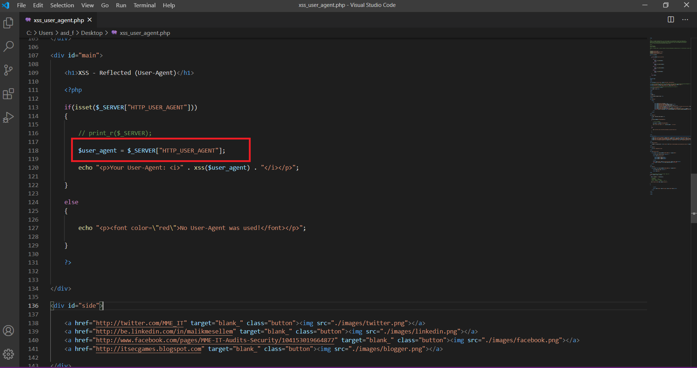
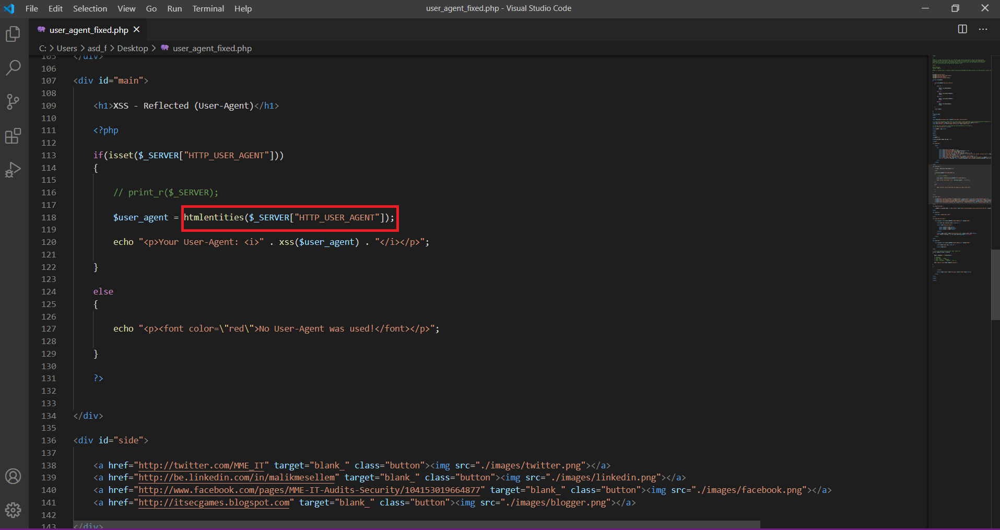
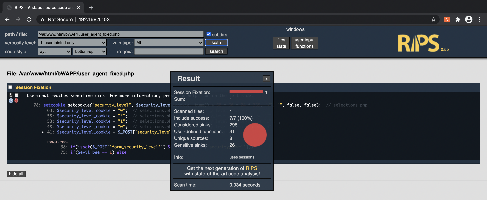

# Cross-Site Scripting - Reflected (User-Agent)

**Step 1:** เปิด browser เข้า URL [bWAPP](#). **Log in** เข้าสู่ระบบ

**Step 2:** เลือกช่องโหว่ที่ต้องการทดสอบ ในที่นี้คือ **XSS - Reflected (User-Agent)** คลิกเลือก **Cross-Site Scripting - Reflected (User-Agent)** และคลิก **Hack**

**Step 3:** Scan ช่องโหว่ด้วย **RIPS** จะแสดงช่องโหว่ **''Cross-Site Scripting"** ที่ตรวจเจอ

**Step 4:** ทดสอบใช้ประโยชน์จากช่องโหว่ที่ตรวจเจอด้วยโปรแกรม **Burp Suite** ซึ่งสามารถ Download ได้จากเว็บไซต์ [portswigger](https://portswigger.net/).
เมื่อเข้าหน้าโปรแกรมให้กด **Proxy** > **Intercept** > **Intercept is on** (เลือกเป็น On)

**Step 5.** คลิกเลือกช่องโหว่ **Cross-Site Scripting - Stored (User-Agent)** > **Hack**

**Step 6.** แก้ไขข้อความในส่วนของ User-Agent ด้วยคำสั่ง **** เพื่อสั่งให้ Popup เด้งขึ้นมาด้วยข้อความที่ตั้งไว้ (Hacked by Marukofar) แล้วคลิก **Forward**

**Step 7.** หน้าเว็บไซต์ URL ที่มีช่องโหว่ข้างต้นจะเด้ง Popup ขึ้นมาด้วยข้อความที่ถูกตั้งไว้

## วิธีแก้ไข

**Step 1.** ใช้ฟังก์ชัน **htmlentities()** เพื่อป้องกันการโจมตีจาก Script ใน PHP เพิ่มเข้าไปในส่วนของตัวแปร **$user_agent**

**Step 2.** ทดสอบ Scan ช่องโหว่อีกครั้งด้วย **RIPS** จะเห็นว่าช่องโหว่ได้รับการแก้ไขแล้ว

**Step 3.** ทดสอบใช้โปรแกรม **Burp Suite** สั่งรันด้วยคำสั่งเดิมจะพบว่าไม่สามารถสั่งให้ Popup เด้งได้

>  -  Fareed Marnleb
>  -  Jaray Paensong