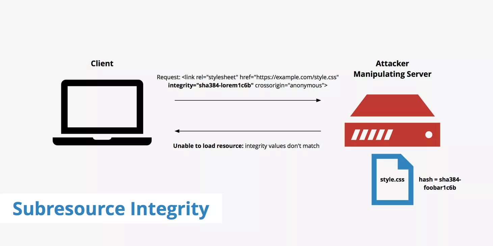
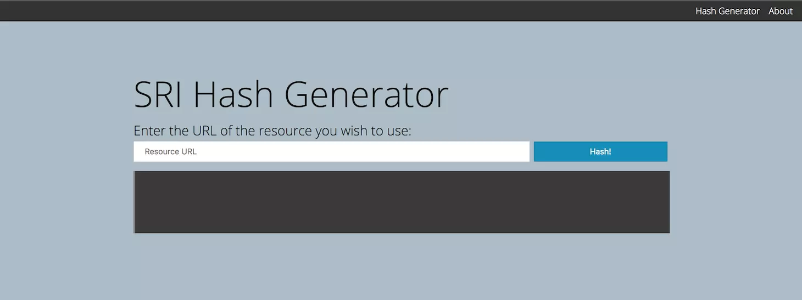

# Subresource Integrity (SRI)



`Subresource integrity` หรือ `SRI` คือ ฟีเจอร์ความปลอดภัยที่จะเป็นตัวช่วยให้เบราว์เซอร์ สามารถตรวจสอบไฟล์ Scripts หรือ Stylesheets นั้นๆ ได้ว่าไม่ถูกแก้ไขไปจากไฟล์ต้นฉบับ ดังนั้น เพื่อเป็นการยืนยันข้อมูลกับเบราว์เซอร์ เราจึงต้องมี flag บางอย่างไว้ให้เบราว์เซอร์ไว้คอยตรวจสอบโดย flag ที่ว่านี้ ก็คือ แอตทริบิวต์ที่ชื่อ integrity นั่นเอง เป็นที่ทราบกันดีว่าข้อมูล 1 ชุดเมื่อเข้า hash function แล้วเราจะได้ค่าคงที่เสมอ ดังนั้น เราจึงอาศัยความจริงข้อนี้ในการนำไฟล์ของเราเข้าสู่ hash function แล้วนำค่าที่ได้ไปใส่ใน integrity แต่ก่อนจะนำไปใส่ต้องแปลงค่าเป็นแบบ base64-encoded เสียก่อน ดังตัวอย่างด้านล่าง

```html 
<script
  src="https://cdnjs.cloudflare.com/ajax/libs/redux/4.0.0/redux.js"
  integrity="sha256-KLkq+W1kKUA6iR5s5Xa/tdzU0yAmXNu7qIGKR/PBoUE="
  crossorigin="anonymous"
/>
```

อย่างไรก็ตาม SRI แตกต่างจาก CSP ตรงที่มี hash function ที่ต้องใช้ไฟล์ที่ดึงมาเพื่อจับคู่ สิ่งนี้มีประโยชน์ในกรณีที่ผู้โจมตีสามารถเข้าถึงไฟล์เว็บของคุณที่ส่งผ่านบริการของบุคคลที่สาม (เช่น CDN) และแทรกเนื้อหาตามอำเภอใจ ปัจจุบันความสามารถในการใช้งานร่วมกันได้ของ Subresource กับเบราว์เซอร์อยู่ที่ประมาณ 75% เมื่อพิจารณาจากเบราว์เซอร์หลักทั้งหมด 


## Subresource Integrity (SRI) ทำงานอย่างไร?

หลังจากที่เข้าเว็บไซต์ เบราว์เซอร์จะเริ่มทำการอ่านไฟล์ที่อยู่ในแท็ก `<script>` หรือ `<link>` ซึ่งถ้าหากแท็กดังกล่าวมีการะบุแอตทริบิวต์ integrity เอาไว้ มันจะทำการตรวจสอบไฟล์ดังกล่าวโดยการดูรหัส hash หากพบว่ามีข้อมูลไม่ตรงกัน Browser จะปฎิเสธการโหลดไฟล์นั้นทันที 

## การสร้าง Subresource Integrity Hash

```bash
openssl dgst -sha384 -binary FILENAME.js | openssl base64 -A
```
หรือสามารถใช้ tool ที่เรียกว่า [srihash.org](https://www.srihash.org/).



tool นี้เพียงแค่เราคัดลอก URL ของ resource ที่เราต้องการสร้างแฮชและจะส่งคืนองค์ประกอบ `<link>` หรือ `<script>` ที่จัดฟอร์แมตอย่างถูกต้องสำหรับ resource นั้น ตัวอย่างเช่น สมมติว่าเราต้องการสร้างแฮชสำหรับไฟล์ Font Awesome ซึ่งโฮสต์บนเซิร์ฟเวอร์ของเรา: 

```bash
https://cdn.keycdn.com/css/font-awesome-4.4.0.min.css
```

เราสามารถป้อนเนื้อหานี้ลงใน tool `srihash` และจะสร้างผลลัพธ์ต่อไปนี้: 

```bash
<link rel="stylesheet" href="https://cdn.keycdn.com/css/font-awesome-4.4.0.min.css" integrity="sha384-MI32KR77SgI9QAPUs+6R7leEOwtop70UsjEtFEezfKnMjXWx15NENsZpfDgq8m8S" crossorigin="anonymous">
```
## ใช้ SRI กับ CSP

จากนโยบายความปลอดภัยของเนื้อหาหรือ CSP เราสามารถกำหนดประเภทของไฟล์ที่เราต้องการใช้ได้ โดยใช้ `Subresource integrity` เช่น หากเราต้องการตรวจสอบ Stylesheets ทั้งหมดโดยใช้ SRI เราสามารถเพิ่มกฎต่อไปนี้ในไฟล์ CSP: 

```bash
Content-Security-Policy: require-sri-for style;
```
นอกจากนี้หากต้องการให้ไฟล์ JavaScript ทั้งหมดใช้ integrity ของ SRI เราสามารถใช้สิ่งต่อไปนี้:

```bash
Content-Security-Policy: require-sri-for script;
```
