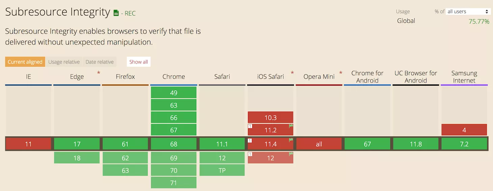

# Subresource Integrity (SRI)


`Subresource integrity` หรือ `SRI` คือ ฟีเจอร์ความปลอดภัยที่จะเป็นตัวช่วยให้เบราว์เซอร์ สามารถตรวจสอบไฟล์ Scripts หรือ Stylesheets นั้นๆ ได้ว่าไม่ถูกแก้ไขไปจากไฟล์ต้นฉบับ ดังนั้น เพื่อเป็นการยืนยันข้อมูลกับเบราว์เซอร์ เราจึงต้องมี flag บางอย่างไว้ให้เบราว์เซอร์ไว้คอยตรวจสอบโดย flag ที่ว่านี้ ก็คือ แอตทริบิวต์ที่ชื่อ integrity นั่นเอง เป็นที่ทราบกันดีว่าข้อมูล 1 ชุดเมื่อเข้า hash function แล้วเราจะได้ค่าคงที่เสมอ ดังนั้น เราจึงอาศัยความจริงข้อนี้ในการนำไฟล์ของเราเข้าสู่ hash function แล้วนำค่าที่ได้ไปใส่ใน integrity แต่ก่อนจะนำไปใส่ต้องแปลงค่าเป็นแบบ base64-encoded เสียก่อน ดังตัวอย่างด้านล่าง

```html 
<script
  src="https://cdnjs.cloudflare.com/ajax/libs/redux/4.0.0/redux.js"
  integrity="sha256-KLkq+W1kKUA6iR5s5Xa/tdzU0yAmXNu7qIGKR/PBoUE="
  crossorigin="anonymous"
/>
```

อย่างไรก็ตาม SRI แตกต่างจาก CSP ตรงที่มี hash function ที่ต้องใช้ไฟล์ที่ดึงมาเพื่อจับคู่ สิ่งนี้มีประโยชน์ในกรณีที่ผู้โจมตีสามารถเข้าถึงไฟล์เว็บของคุณที่ส่งผ่านบริการของบุคคลที่สาม (เช่น CDN) และแทรกเนื้อหาตามอำเภอใจ ปัจจุบันความสามารถในการใช้งานร่วมกันได้ของ Subresource กับเบราว์เซอร์อยู่ที่ประมาณ 75% เมื่อพิจารณาจากเบราว์เซอร์หลักทั้งหมด 



## Subresource Integrity (SRI) ทำงานอย่างไร?

หลังจากที่เข้าเว็บไซต์ เบราว์เซอร์จะเริ่มทำการอ่านไฟล์ที่อยู่ในแท็ก `<script>` หรือ `<link>` ซึ่งถ้าหากแท็กดังกล่าวมีการะบุแอตทริบิวต์ integrity เอาไว้ มันจะทำการตรวจสอบไฟล์ดังกล่าวโดยการดูรหัส hash หากพบว่ามีข้อมูลไม่ตรงกัน Browser จะปฎิเสธการโหลดไฟล์นั้นทันที 

## การสร้าง Subresource Integrity Hash

```bach
openssl dgst -sha384 -binary FILENAME.js | openssl base64 -A
```


