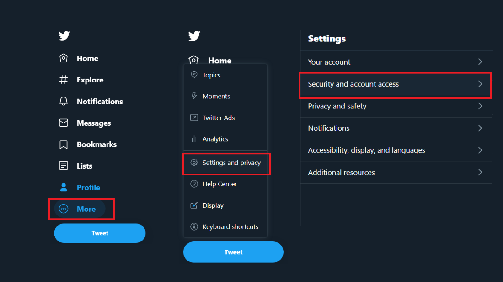
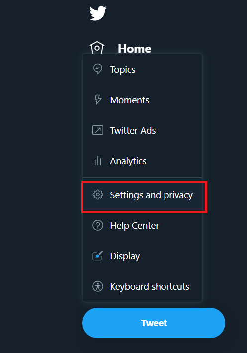
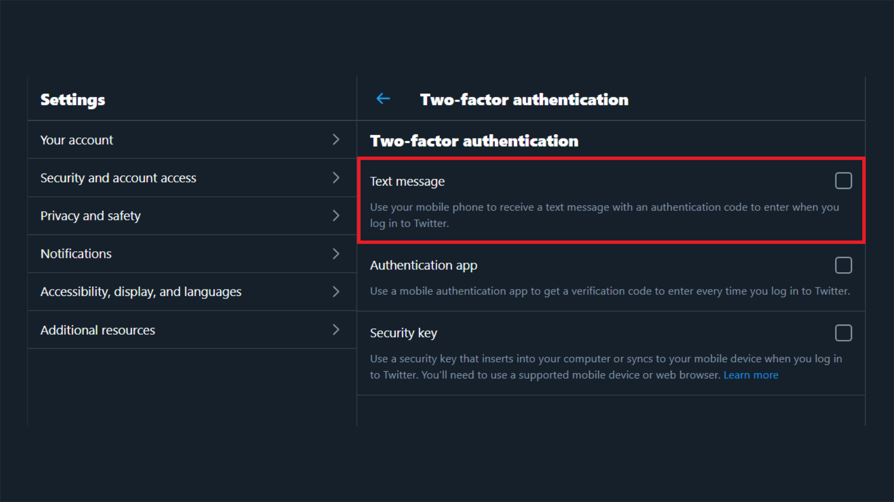
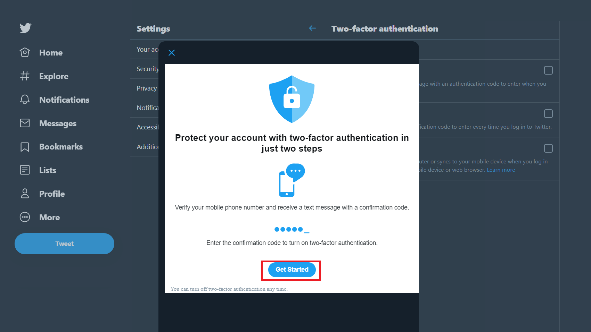
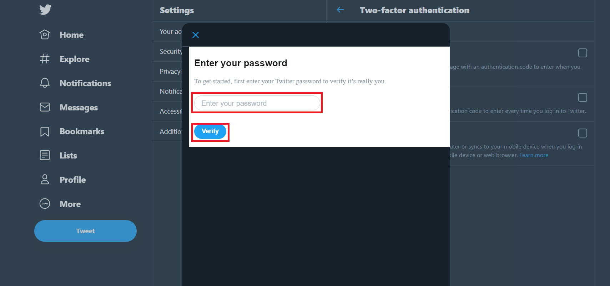
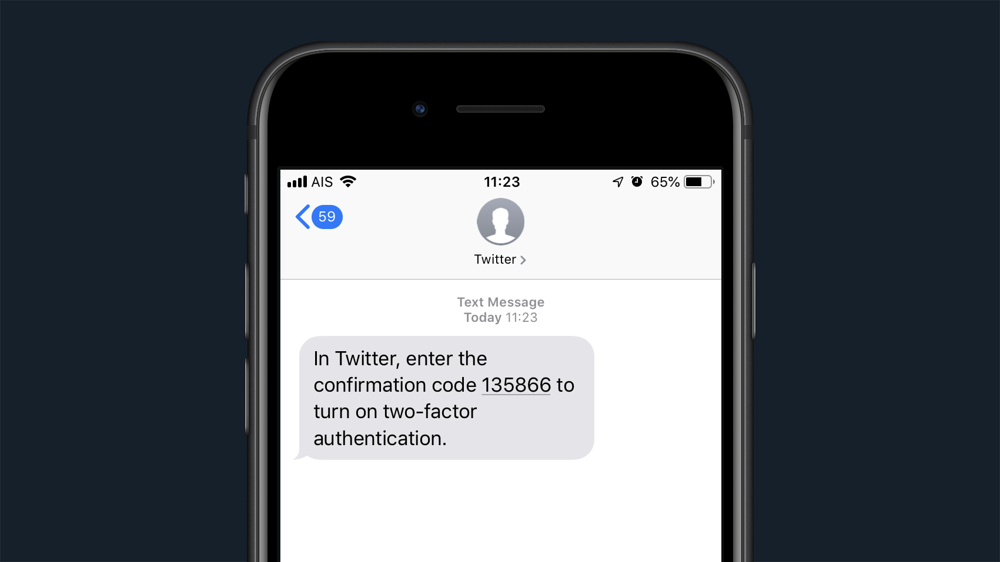
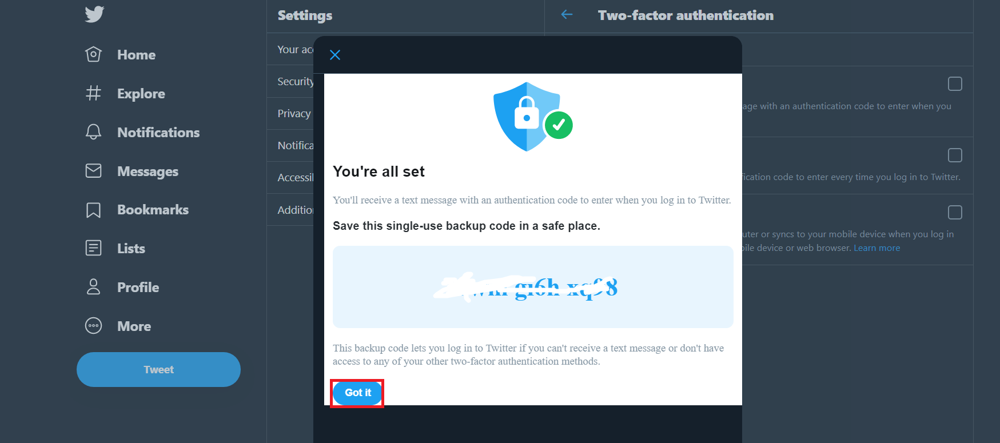
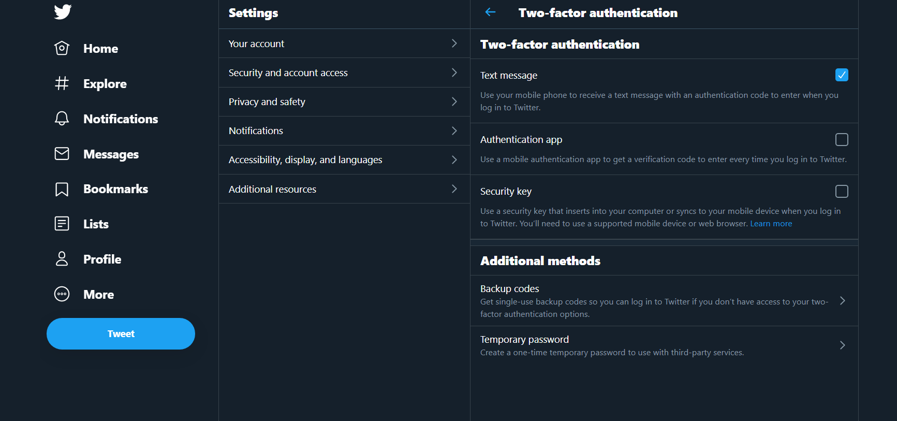

# Two-factor authentication On Twitter

## วิธีเปิดใช้งานการยืนยันตัวตนแบบสองชั้นทวิตเตอร์ 

>  Step 1: Open a browser and visit twitter.com.
>  Step 2: Log in to your Twitter account by entering your user ID and password.

>  2. กด

>  3. 

>  4. 

>  5. 

>  6. 

>  7. 

>  8. 

>  9. 

>  10. 

>  11. 

>  12. 

>  13. 

