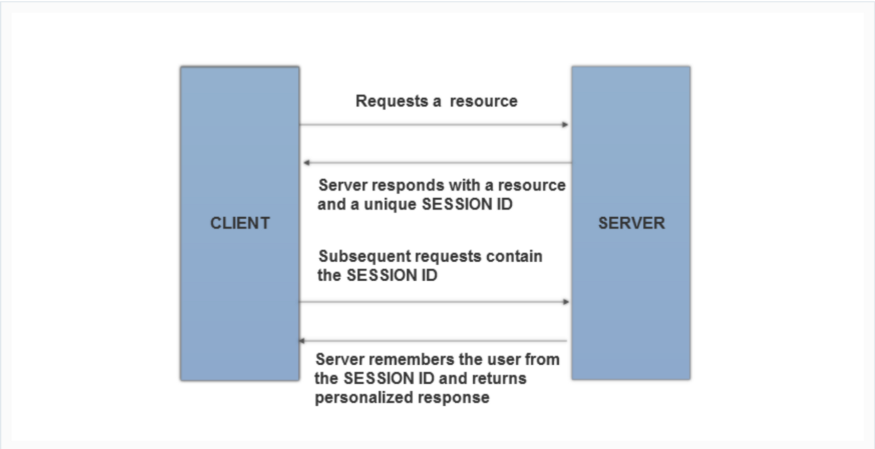

# V3.3 Session Logout and Timeout Requirements 

## Session คืออะไร?

**Session** คือ เป็นสิ่งที่ Client สร้างขึ้นมาเมื่อเปิดเว็บบราวเซอร์และติดต่อมายังเว็บเซิฟเวอร์ผ่านทาง URL ของเว็บไซต์ เมื่อ Client ทำการปิดโปรแกรมเว็บบราวเซอร์ Session ก็จะถูกทำลายหรือปิดลง ข้อมูลที่ถูกเก็บในตัวแปร Session จะถูกบันทึกเป็นไฟล์ Session เช่นเดียวกับไฟล์คุกกี้ แต่ Session จะเก็บไฟล์ไว้ที่ฝั่งเซิร์ฟเวอร์ อายุของ Session ถูกกำหนดด้วยการทำงานของเบราเซอร์ 

Ref: [https://code.tutsplus.com/tutorials/how-to-use-sessions-and-session-variables-in-php--cms-31839](https://code.tutsplus.com/tutorials/how-to-use-sessions-and-session-variables-in-php--cms-31839).

> **Session Timeout** ก็คือ Event ที่เกิดขึ้นเมื่อผู้ใช้ไม่ดำเนินการใด ๆ บนเว็บไซต์ในช่วงเวลาหนึ่ง (กำหนดโดยเว็บเซิร์ฟเวอร์) Event ในฝั่งเซิร์ฟเวอร์เปลี่ยนสถานะของ Session ผู้ใช้เป็น "invalid" (เช่น "ไม่ได้ใช้อีกต่อไป") และสั่งให้เว็บเซิร์ฟเวอร์ลบข้อมูลที่มีอยู่ในนั้นทั้งหมด

Ref: [https://code.tutsplus.com/tutorials/how-to-use-sessions-and-session-variables-in-php--cms-31839](https://code.tutsplus.com/tutorials/how-to-use-sessions-and-session-variables-in-php--cms-31839).

## ผลกระทบของ Session Timeout ในด้าน Security และแนวทางการรับมือที่ดี

Session Timeout จะเป็นตัวกำหนดเวลาหน้าต่าง Event ที่ดำเนินการต่างๆ ของผู้ใช้งานเว็บไซต์นั้นๆ และหน้าต่างนี้ยังแสดงถึงเวลาที่แฮกเกอร์สามารถเข้ามาขโมย Session และใช้ Session ของผู้ใช้ที่มีอยู่ได้  

**แนวทางการรับมือที่ดีที่สุด คือ:**