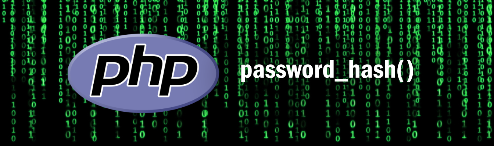

# PHP password_hash()

`password_hash()` ใช้ 

### Key Points:

- 

### รูปแบบการใช้งาน

```php 
password_hash ( string $password , mixed $algo , array $options = ? ) : string|false
```

### ตัวอย่างการใช้ `password_hash()` 

### แบบที่ 1
```php
<?php

echo password_hash("rasmuslerdorf", PASSWORD_DEFAULT);
?>
```
#### Output:

```bash
$2y$10$.vGA1O9wmRjrwAVXD98HNOgsNpDczlqm3Jq7KnEd1rVAGv3Fykk1a
```
### แบบที่ 2 
```php
<?php

$options = [
    'cost' => 12,
];
echo password_hash("rasmuslerdorf", PASSWORD_BCRYPT, $options);
?> 
```
#### Output:

```bash
$2y$12$QjSH496pcT5CEbzjD/vtVeH03tfHKFy36d4J0Ltp3lRtee9HDxY3K
```

### แบบที่ 3 
```php
<?php

$timeTarget = 0.05; // 50 milliseconds 

$cost = 8;
do {
    $cost++;
    $start = microtime(true);
    password_hash("test", PASSWORD_BCRYPT, ["cost" => $cost]);
    $end = microtime(true);
} while (($end - $start) < $timeTarget);

echo "Appropriate Cost Found: " . $cost;
?>
```
#### Output:

```bash
Appropriate Cost Found: 10
```

### แบบที่ 4 
```php
<?php

echo 'Argon2i hash: ' . password_hash('rasmuslerdorf', PASSWORD_ARGON2I);
?>
```
#### Output:

```bash
Argon2i hash: $argon2i$v=19$m=1024,t=2,p=2$YzJBSzV4TUhkMzc3d3laeg$zqU/1IN0/AogfP4cmSJI1vc8lpXRW9/S0sYY2i2jHT0
```

### Note

> **คำเตือน!!!**
> สำหรับฟังก์ชัน password_hash() ไม่แนะนำให้เติม salt ด้วยตัวเอง โดยค่าเริ่มต้นฟังก์ชั่นนี้ จะเติม Salt ให้อัตโนมัติซึ่งมีความปลอดภัยอยู่แล้ว
> 
> ตั้งแต่ PHP 7.0 เป็นต้นไปมีคำเตือนห้ามเติม salt ด้วยตัวเอง และในอนาคต PHP เวอร์ชั่นใหม่ก็จะยกเลิกการเติม Salt ด้วยตัวเองไปโดยปริยาย 


#### References:

- https://www.php.net/manual/en/function.password-hash.php


