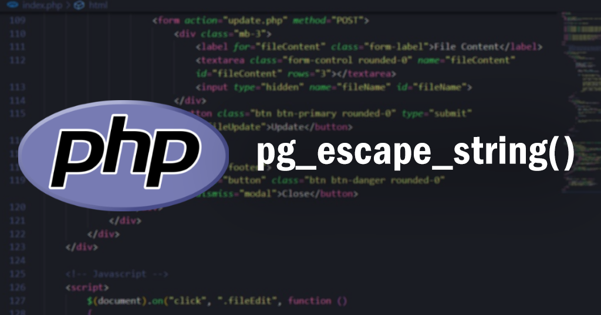
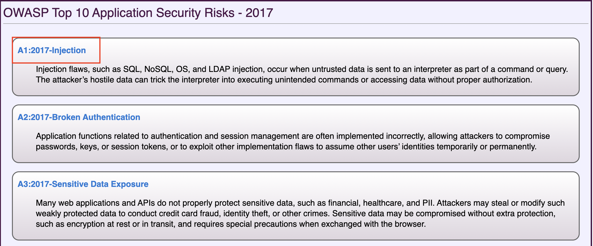
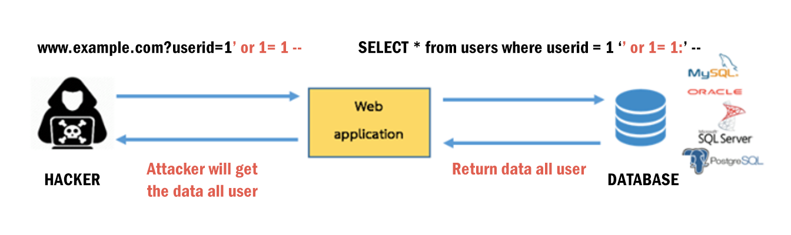

# PHP pg_escape_string
`pg_escape_string()` ใช้หลีกเลี่ยงสตริง(ทุกตัวแปร) หรือเลี่ยงการใช้ตัวอักขระพิเศษในคำสั่ง SQL เช่น เครื่องหมาย " เครื่องหมาย ' เป็นต้น ที่ผ่านการป้อนค่าเข้ามาของผู้ใช้ ฟังก์ชันนี้ใช้สำหรับจัดการฐานข้อมูล PostgreSQL หากใช้ MySQL จะใช้ฟังก์ชัน `mysql_escape_string()` แทน ซึ่งฟังก์ชันเหล่านี้สามารถป้องกัน SQL injection attack ได้

## SQL injection คืออะไร?
การโจมตีระบบฐานข้อมูลของเว็บแอปพลิเคชั่น โดยอาศัยช่องโหว่ของการใส่ข้อมูล Input form ของผู้ใช้ยิงคำสั่ง SQL เข้าไป เพื่อให้สามารถเข้าถึงฐานข้อมูลหรือถึงระบบของเว็บแอพพลิเคชั่นได้   
จากข้อมูลของ [OWASP](https://owasp.org/www-project-top-ten/2017/) OWASP Top 10 Application Security Risks - 2017 จะเห็นได้ว่า SQL injection attacks เป็นช่องโหว่หรือภัยคุกคามต่อความปลอดภัยที่เหล่าผู้ไม่ประสงค์ดี (Hacker) ใช้ในการโจมตีฐานข้อมูลและเว็บแอปพลิเคชันที่เกิดขึ้นบ่อยอันดับ 1 และอันตรายมากที่สุด



ตัวอย่างการทำ SQL injection



แฮกเกอร์จะใส่เป็น Logic Statement เช่น แค่พิมพ์คำสั่ง SQL or 1=1 ซึ่งมีค่าเป็นจริง (True) เสมอ เป็นการเปรียบเทียบเงื่อนในการดึงข้อมูลจากฐานข้อมูล ฐานข้อมูลเมื่อรับค่ามาว่า or 1=1 มีไหม ซึ่งแน่นอนว่ามีเพราะค่า or 1=1 มีค่าเป็นจริง (True) ฐานข้อมูลจึงส่งคืนค่า user ทั้งหมดกลับไป ทำให้แฮกเกอร์ได้ข้อมูลทั้งหมดหรือเข้าสู่ระบบของเว็บนั้นได้

วิธีป้องกัน SQL Injection

ในการเอาค่าที่รับมาจากผู้ใช้ไปรวมเป็น query นั้น ควรจะต้อง "escape" ค่าที่รับมาจากผู้ใช้ที่มีลักษณะที่เป็น SQL injection statement ด้วยฟังก์ชั่นที่เหมาะสม เช่น ฟังก์ชัน `pg_escape_string()` สำหรับการใช้งานฐานข้อมูล PostgreSQL  ก่อนที่จะส่งให้กับระบบฐานข้อมูล SQL ต่อไป

### รูปแบบการใช้งาน

```php 
pg_escape_string ( resource $connection = ? , string $data ) : string
```

### Parameters 

- connection - หมายเลขอ้างอิงที่เป็นทางเลือกสำหรับจัดการการเชื่อมต่อของสตริง ที่ควรจะหลบหนี (escaped) จากการส่งไป
- data - สตริงที่ต้องการหลบหนี (escape)

### การคืนค่า

`pg_escape_string()` จะคืนค่าเป็นอาร์กิวเมนต์ของสตริง + อักขระที่เพิ่มมา

### ตัวอย่างการใช้ `pg_escape_string()`

### ตัวอย่าง

```php 
<?php 
  // เชื่อมต่อฐานข้อมูล 
  $dbconn = pg_connect('dbname=Maruko');
  
  // สั่งให้อ่านจาก text file (ประกอบไปด้วย apostrophes(') และ backslashes(\))
  $data = file_get_contents('letter.txt');
  
  // Escape ข้อมูลจากตัวแปร $data
  $escaped = pg_escape_string($data);
  
  // แทรกข้อมูลลงในฐานข้อมูล
  pg_query("INSERT INTO correspondence (name, data) VALUES ('My letter', '{$escaped}')");
?>
```

#### Reference
- https://www.php.net/pg_escape_string
- https://alexwebdevelop.com/sql-injection/
