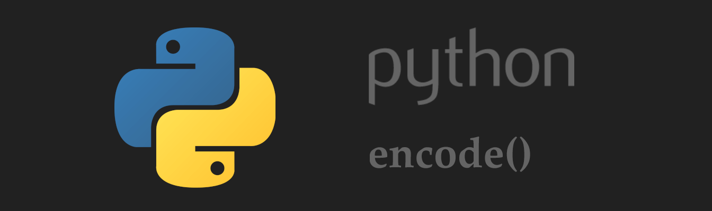
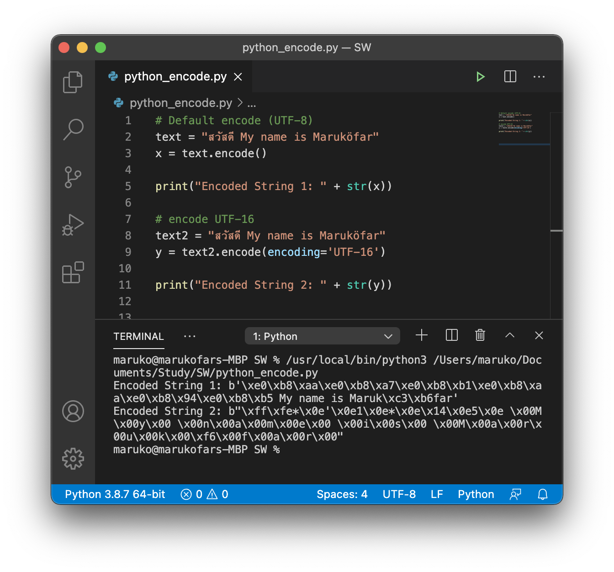

# Python String encode()

การเข้ารหัสข้อความใน Python ด้วยฟังก์ชั่น encode() ตั้งแต่ Python 3.0 สตริง (str) จะถูกจัดเก็บเป็น Unicode โดยค่าเริ่มต้นจะเป็น UTF-8 
ฟังก์ชัน encode จะเปลี่ยน str ให้เป็น bytes 

### รูปแบบการใช้งาน

```python 
str.encode(encoding='UTF-8',errors='strict') 
```

### Parameters

- **encoding** - str สำหรับระบุรูปแบบที่ใช้เข้ารหัส เช่น UTF-8, base64 เป็นต้น หากไม่ระบุค่าเริ่มต้นจะเป็น UTF-8
- **errors** - str สำหรับระบุ Error (จะระบุหรือไม่ระบุก็ได้) ค่าเริ่มต้นสำหรับข้อผิดพลาดคือ "strict" ก็คือ ข้อผิดพลาดในการเข้ารหัสทำให้เกิด UnicodeError นั่นเอง โดยค่าที่ใช้ได้มีดังนี้
    - **strict** - (ค่าเริ่มต้น) แจ้งว่าเกิดข้อผิดพลาด UnicodeError
    - **backslashreplace** - ใช้เครื่องหมาย \ แทนตัวอักษรที่ไม่สามารถเข้ารหัสได้
    - **ignore** - ไม่สนใจตัวอักษรที่ไม่สามารถเข้ารหัสได้
    - **namereplace** - แทนที่ตัวอักษรด้วยข้อความสำหรับอธิบายตัวอักษรนั้น
    - **replace** - แทนที่ตัวอักษรด้วยเครื่องหมายคำถาม ?
    - **xmlcharrefreplace** - แทนที่ตัวอักษรด้วย xml character

### ตัวอย่างการใช้ encode() ไม่ระบุรูปแบบการเข้ารหัส

```python
text = "สวัสดี My name is Maruköfar" 

x = text.encode()

print("Encoded String: " + str(x))
```

### Output:

```python
Encoded String: b'\xe0\xb8\xaa\xe0\xb8\xa7\xe0\xb8\xb1\xe0\xb8\xaa\xe0\xb8\x94\xe0\xb8\xb5 My name is Maruk\xc3\xb6far' 
```

### ตัวอย่างการใช้ encode() ระบุรูปแบบการเข้ารหัสเป็น UTF-16

```python
text = "สวัสดี My name is Maruköfar"

x = text.encode(encoding='UTF-16')
 
print("Encoded String: " + str(x))
```

### Output:


```python
Encoded String: b"\xff\xfe*\x0e'\x0e1\x0e*\x0e\x14\x0e5\x0e \x00M\x00y\x00  \x00n\x00a\x00m\x00e\x00 \x00i\x00s\x00 \x00M\x00a\x00r\x00u\x00k\x00\xf6\x000f\x00a\x00r\x00"  
```




### References:

- https://www.programiz.com/python-programming/methods/string/encode
- https://www.dcrub.com/python-string-encode-method

